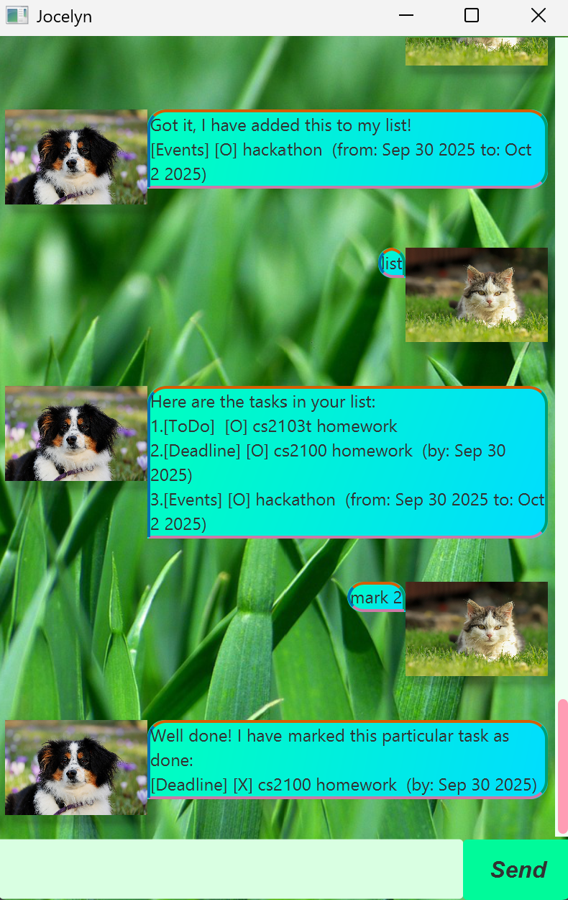

# chatbot.Jocelyn User Guide



Use chatbot.Jocelyn, the newest Chatbot that allows you 
to keep tracking of everything, whether it be 
events, deadlines or event todo items!

## Adding deadlines

Add a deadline to the list of tasks. 

Format: deadline deadline_task /by YYYY-MM-DD

Example: `deadline do homework /by 2025-09-30`

By doing this, you are able to add a task. 
```
expected output
```

## Feature ABC

// Feature details


## Feature XYZ

// Feature details