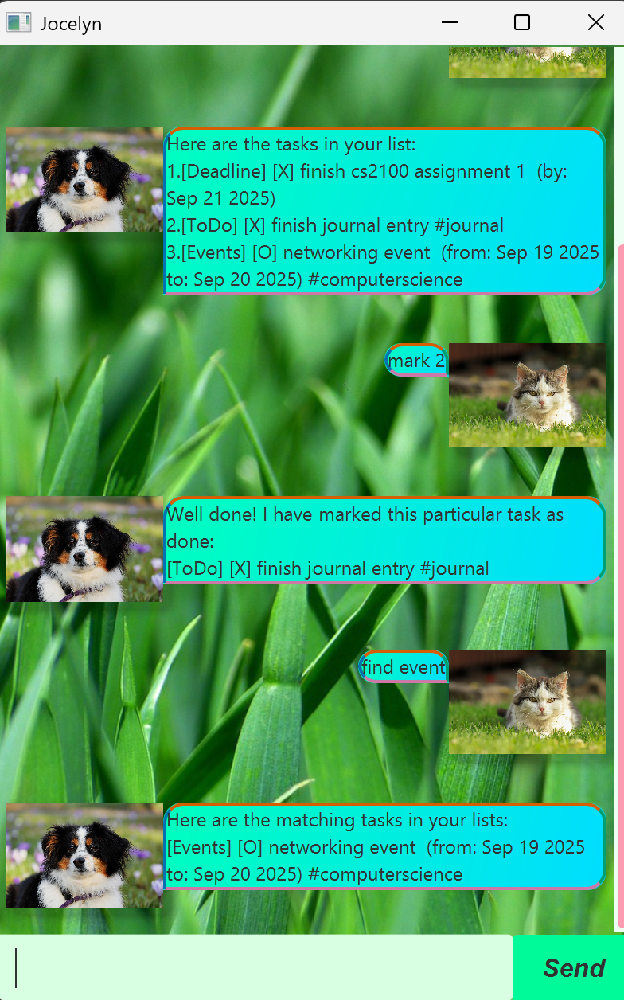

# Jocelyn User Guide



Use Jocelyn, the newest chat bot that allows you 
to keep tracking of everything, whether it be 
your daily tasks, deadlines or events!


## Adding ToDo Items

Add a ToDo item to the list of tasks.
Note that you may add tags to any ToDo items.

Format: todo task

Examples: 
1. `todo do homework`
2. `todo write in journal #writing #is #fun`

Possible Output:
```
Got it, I have added it to my list!
[ToDo] [O] do homework
Now, you have xx objects in your list right now!
```

## Adding Deadlines

Add a deadline to the list of tasks.
Note that you may add tags to any deadlines.

Format: deadline deadline_task /by YYYY-MM-DD

Examples: 
1. `deadline do homework /by 2025-09-30`
2. `deadline takes notes on history #history #Singapore /by 2025-09-30`

By doing this, you are able to add a task.
```
Got it, I have added it to my list!
[Deadline] [O] do homework (by: Sep 30 2025)
Now, you have xx objects in your list right now!
```

## Adding Events 

Add an event to the list of tasks.
Note that you may add tags to any events.

Format: event task /from YYYY-MM-DD /to YYYY-MM-DD

Examples: 
1. `event do homework /from 2025-09-19 /to 2025-09-21`
2. `event holiday trip #happy #day /from 2025-09-19 /to 2025-09-21`

Possible Output:
```
Got it, I have added it to my list!
[Events] [O] do homework (from: Sep 19 2025 to: Sep 21 2025)
Now, you have xx objects in your list right now!
```

## Deleting Tasks

Delete a task from the tasklist.

Format: delete number_on_list_starting_from_one

Example: `delete 3`

Possible Output:
```
Noted. I have removed the current task!
[Events] [O] do homework (from: Sep 19 2025 to: Sep 21 2025)
Now, you have xx objects in your list right now.
```

## Mark Item

Mark an item to your lists of tasks.

Format: mark number_on_list_starting_from_one

Example: `mark 3`

Possible Output:
```
Well done, I have marked this particular task as done:
[Events] [X] do homework (from: Sep 19 2025 to: Sep 21 2025)
```

## Unmark Item

Unmark an item to your lists of tasks.

Format: unmark number_on_list_starting_from_one

Example: `unmark 3`

Possible Output:
```
Okay, I have marked this particular task as not done yet.
[Events] [O] do homework (from: Sep 19 2025 to: Sep 21 2025)
```
## List Items

Show your current tasklist.

Format: list

Example: `list`

Possible Output:
```
Here are the tasks in your list:
1.[ToDo] [O] do homework
```

## Add Tag to Item

Add a tag to an item that already exists.

Format: addtag item_number tags

Example: `addtag 1 #happy #day`

Possible Output:
```
Got it, I have added the tags to task 1.
This is the current element: 
[ToDo] [O] do homework #happy #tag
```
## Delete Tag to Item

Delete a tag to an item that already exists.

Format: deletetag item_number tags

Example: `deletetag 2 #school`

Possible Output:
```
Got it, I have removed the tags for task 1.
This is the current element: 
[Deadline] [O] cs2100 assignment 1 (by: Sep 19 2025).
```

## Find

Find items on the list that match your search term!

Format: find search_term

Example: `find homework`

Possible Output:
```
Here are the matching tasks in your lists:
[Events] [O] do homework (from: Sep 19 2025 to: Sep 21 2025)
[ToDo] [O] do cs2103T project
```
## Bye

Exit the GUI. 

Format: `bye`

Possible Output: 
The program exits out of the GUI.

